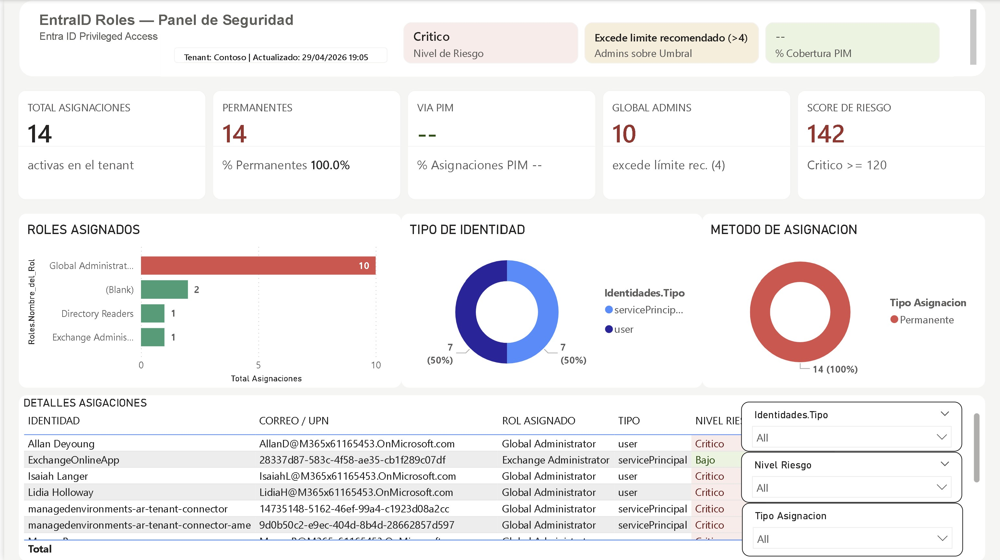
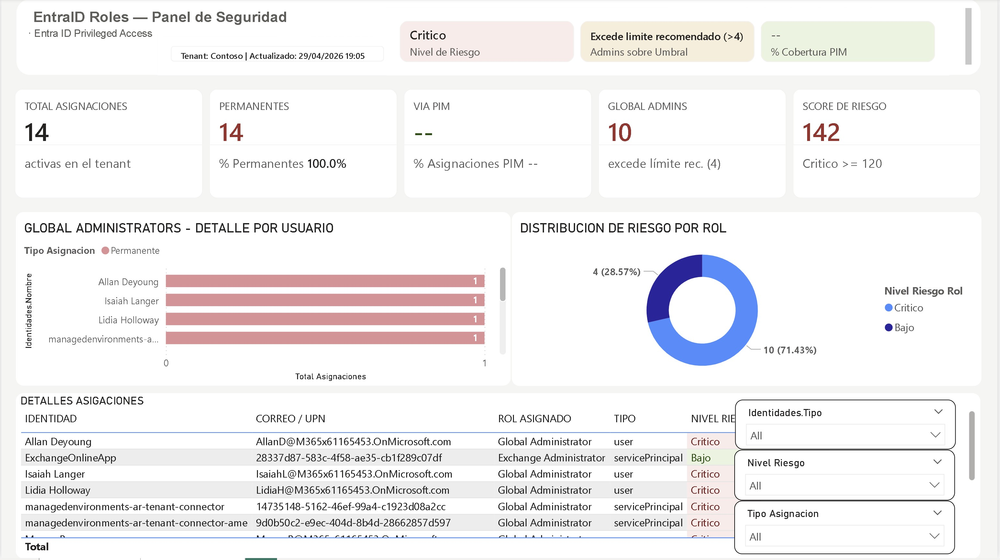

# 📊 Dashboard Entra ID Roles — Power BI Template

**Empresa:** Expertego  
**Versión:** 1.0  
**Fecha:** Abril 2026  
**Contacto:** info@expertego.com  
**Licencia:** Uso bajo los términos descritos en la sección [Disclaimer](#disclaimer)

---

## 📋 Descripción

Template de Power BI para auditoría y monitoreo de **roles privilegiados en Microsoft Entra ID** (anteriormente Azure Active Directory). Conecta directamente con Microsoft Graph API usando un App Registration con credenciales de servicio, sin requerir intervención manual ni login interactivo.

Permite a equipos de seguridad, identidad y cumplimiento obtener visibilidad inmediata sobre:

- Qué identidades tienen roles privilegiados asignados
- Qué roles están asignados de forma permanente vs. gestionados via PIM
- El nivel de riesgo general del tenant basado en factores documentados por Microsoft y CIS
- Asignaciones huérfanas (sin identidad activa asociada)

---

## 📸 Vista Previa

*Figura 1: Vista página 1 del estado de gobernanza y roles privilegiados.*


*Figura 2: Vista página 2 del estado de gobernanza y roles privilegiados.*

## ✅ Requisitos

### Power BI Desktop
- Power BI Desktop **versión actualizada** (recomendado: versión de Marzo 2024 o posterior)
- El template es un archivo `.pbit` — no requiere licencia Power BI Pro para uso local

### Licenciamiento Microsoft
| Componente | Requerido | Notas |
|---|---|---|
| Microsoft Entra ID | ✅ Cualquier tier | Para asignaciones activas de roles |
| Microsoft Entra ID P2 | ⚠️ Opcional | Solo requerido para datos de elegibilidad PIM |
| Microsoft Entra ID Governance | ⚠️ Opcional | Alternativa a P2 para PIM |

> Si el tenant no tiene licencia P2 o Governance, el reporte carga correctamente pero la tabla de elegibilidad PIM aparecerá vacía — esto es comportamiento esperado.

### App Registration en Entra ID
Se requiere un App Registration en el tenant destino con los siguientes permisos de **Microsoft Graph — Application** (no Delegated), todos con **Admin Consent** otorgado:

| Permiso | Propósito |
|---|---|
| `RoleManagement.Read.All` | Leer asignaciones y definiciones de roles |
| `User.Read.All` | Leer información de usuarios |
| `Application.Read.All` | Leer service principals |
| `Group.Read.All` | Leer grupos |
| `Organization.Read.All` | Leer nombre y dominio del tenant |

> ⚠️ **Todos los permisos son Application (no Delegated)** porque el flujo usa `client_credentials`. Requieren Admin Consent del Global Administrator del tenant.

---

## 🚀 Cómo usar el template

### Paso 1 — Crear el App Registration

1. Accede al portal de **Entra ID** → **App registrations** → **New registration**
2. Nombre sugerido: `PBI-EntraIDRoles-Reader`
3. Supported account types: *Accounts in this organizational directory only*
4. Sin Redirect URI
5. En **API permissions** agrega los 5 permisos listados arriba como **Application permissions**
6. Haz clic en **Grant admin consent**
7. En **Certificates & secrets** → **New client secret** → copia el **Value** inmediatamente

### Paso 2 — Obtener los 3 valores necesarios

En el portal de Entra ID, en el App Registration creado:

| Parámetro | Dónde encontrarlo |
|---|---|
| `TenantID` | Overview → *Directory (tenant) ID* |
| `ClientID` | Overview → *Application (client) ID* |
| `ClientSecret` | El valor copiado al crear el secret |

### Paso 3 — Abrir el template

1. Haz doble clic en el archivo `EntraIDRoles_Template.pbit`
2. Power BI Desktop mostrará un formulario solicitando los 3 parámetros
3. Ingresa `TenantID`, `ClientID` y `ClientSecret` del tenant a auditar
4. Haz clic en **Load**

### Paso 4 — Configurar autenticación en Power Query

Al cargar por primera vez, Power BI solicitará autenticación para las fuentes de datos:

1. Para `https://login.microsoftonline.com` → selecciona **Anónimo** → nivel de privacidad **Organizacional**
2. Para `https://graph.microsoft.com` → selecciona **Anónimo** → nivel de privacidad **Organizacional**

> El token de autenticación lo gestiona el propio query M usando las credenciales del App Registration — no se requiere login interactivo.

### Paso 5 — Guardar como .pbix

Una vez cargados los datos, guarda el archivo como `.pbix` para este tenant específico mediante **Archivo → Guardar como**.

---

## 📁 Estructura del modelo de datos

El modelo contiene las siguientes tablas:

| Tabla | Descripción | Fuente |
|---|---|---|
| `Asignaciones` | Roles activos asignados en el directorio | `/v1.0/roleManagement/directory/roleAssignments` |
| `Elegibilidad` | Roles elegibles via PIM (requiere Entra ID P2) | `/v1.0/roleManagement/directory/roleEligibilityScheduleInstances` |
| `Identidades` | Usuarios, service principals y grupos del tenant | `/v1.0/users`, `/v1.0/servicePrincipals`, `/v1.0/groups` |
| `Roles` | Definiciones de roles de Entra ID | `/v1.0/roleManagement/directory/roleDefinitions` |
| `Reporte_Final` | Tabla combinada con todas las asignaciones enriquecidas | Combinación de las tablas anteriores |
| `_Config` | Nombre del tenant, dominio y fecha de actualización | `/v1.0/organization` |

### Parámetros
| Parámetro | Descripción |
|---|---|
| `TenantID` | ID del tenant de Entra ID (GUID) |
| `ClientID` | Application (client) ID del App Registration |
| `ClientSecret` | Valor del Client Secret del App Registration |

---

## 📊 Indicadores y visualizaciones

### Tarjetas KPI

| Indicador | Descripción |
|---|---|
| **Total Asignaciones** | Número total de asignaciones de roles activas en el tenant |
| **Asignaciones Permanentes** | Roles asignados de forma permanente (sin fecha de expiración) |
| **Asignaciones PIM** | Roles gestionados via Privileged Identity Management |
| **Global Admins** | Cantidad de identidades con rol Global Administrator |
| **Score de Riesgo** | Puntuación ponderada de riesgo del tenant (ver detalle abajo) |

### Gráficos

| Visualización | Descripción |
|---|---|
| Barras horizontales | Roles más asignados, ordenados por cantidad con código de color por nivel de riesgo |
| Dona — Tipo de identidad | Distribución entre usuarios, service principals y grupos |
| Dona — Método de asignación | Proporción de asignaciones Permanentes vs PIM |
| Barras apiladas | Global Administrators desglosados por usuario y método |
| Tabla de detalle | Todas las asignaciones con formato condicional por nivel de riesgo |

### Segmentadores (filtros interactivos)
- Tipo de identidad (`user`, `servicePrincipal`, `group`)
- Nivel de riesgo (`Critico`, `Alto`, `Medio`, `Bajo`)
- Método de asignación (`Permanente`, `PIM`)

---

## 🔢 Score de Riesgo — Metodología

El Score de Riesgo es una métrica ponderada propia de este template, basada en factores documentados por **Microsoft** y el **CIS (Center for Internet Security)**.

### Fórmula

```
Score = (Global Admins × 10) + (Asignaciones Permanentes × 3) + (Roles sin Identidad × 5)
```

### Justificación de pesos

| Factor | Peso | Respaldo |
|---|---|---|
| Global Admins | ×10 | Rol de máximo privilegio en el tenant. Microsoft recomienda <5. |
| Asignaciones Permanentes | ×3 | Microsoft recomienda eliminar asignaciones permanentes y usar PIM Just-in-Time. |
| Roles sin Identidad | ×5 | Asignaciones huérfanas — la identidad fue eliminada pero el rol persiste, riesgo de reactivación. |

### Niveles de riesgo

| Nivel | Score | Descripción |
|---|---|---|
| 🟢 **Bajo** | < 40 | Configuración dentro de las mejores prácticas |
| 🟡 **Medio** | 40 – 79 | Algunas mejoras recomendadas |
| 🟠 **Alto** | 80 – 119 | Acciones correctivas prioritarias |
| 🔴 **Crítico** | ≥ 120 | Riesgo elevado — acción inmediata recomendada |

> **Nota:** Este score es orientativo y no reemplaza una evaluación de seguridad formal. Ver sección [Referencias](#referencias) para frameworks oficiales.

### Umbral de Global Admins

El umbral de **≥5 Global Admins = riesgo** está respaldado por:
- **Microsoft:** recomienda menos de 5 Global Administrators — [Best practices para roles de Entra ID](https://learn.microsoft.com/en-us/entra/identity/role-based-access-control/best-practices#5-limit-the-number-of-global-administrators-to-less-than-5)
- **CIS Benchmark:** recomienda mínimo 2, máximo 4 Global Administrators
- **CISA:** valida el límite de menos de 5

---

## 🔍 Glosario de términos

**Asignación permanente:** Rol asignado directamente a una identidad sin fecha de expiración. Representa mayor riesgo porque el acceso privilegiado está siempre activo.

**Asignación PIM (Just-in-Time):** Rol gestionado via Privileged Identity Management. La identidad es elegible para el rol pero debe activarlo explícitamente, por un tiempo limitado y opcionalmente con aprobación y MFA adicional.

**Asignación huérfana (Rol sin identidad):** Asignación de rol donde la identidad destino (usuario, grupo o service principal) fue eliminada del directorio pero el registro de asignación persiste. Representa un riesgo porque si la cuenta es restaurada hereda automáticamente esos privilegios.

**Service Principal:** Identidad de aplicación o servicio en Entra ID. Equivalente a una cuenta de servicio. Los service principals con roles privilegiados deben monitorearse especialmente porque no tienen MFA.

**Break Glass Account:** Cuenta de acceso de emergencia con rol Global Administrator, diseñada para usarse solo cuando otros métodos de acceso fallan. Deben existir al menos 2 y estar excluidas de políticas de Conditional Access.

---

## 🔄 Actualización de datos

Los datos se actualizan cada vez que se hace **Refresh** en Power BI Desktop o en el servicio de Power BI si el reporte fue publicado.

La columna **Última Actualización** en el encabezado del reporte refleja el momento exacto en que se ejecutó el último refresh.

> ⚠️ **El Client Secret tiene fecha de expiración.** Se recomienda configurar una alerta en el App Registration o documentar la fecha de expiración. Cuando expire, todos los queries fallarán con error `401 Unauthorized` y deberás generar un nuevo secret y actualizar el parámetro `ClientSecret` en el archivo `.pbix`.

---

## 📚 Referencias

| Recurso | Enlace |
|---|---|
| Microsoft — Best practices para roles de Entra ID | https://learn.microsoft.com/en-us/entra/identity/role-based-access-control/best-practices |
| Microsoft — Identity Secure Score | https://learn.microsoft.com/en-us/entra/identity/monitoring-health/concept-identity-secure-score |
| Microsoft — Privileged Identity Management | https://learn.microsoft.com/en-us/entra/id-governance/privileged-identity-management/pim-configure |
| Microsoft — Access Reviews | https://learn.microsoft.com/en-us/entra/id-governance/access-reviews-overview |
| CIS Microsoft Azure Foundations Benchmark | https://www.cisecurity.org/benchmark/azure |
| CISA — M365 / Entra ID Security Guidance | https://www.cisa.gov/resources-tools/services/m365-entra-id |
| Microsoft Graph API — Role Management | https://learn.microsoft.com/en-us/graph/api/resources/rolemanagement |

---

## ⚠️ Disclaimer

**© 2026 Expertego. Todos los derechos reservados.**

Este template de Power BI es desarrollado y distribuido por **Expertego** con fines informativos y de apoyo a tareas de auditoría y monitoreo de seguridad en entornos Microsoft Entra ID.

**Al usar este template, el usuario acepta los siguientes términos:**

1. **Uso permitido:** Este template puede ser utilizado libremente para auditoría interna de seguridad en organizaciones. Se permite su descarga y uso sin modificación de la atribución de autoría.

2. **Prohibiciones:** Queda prohibida la redistribución comercial, reventa, o presentación del template como trabajo propio sin autorización expresa y por escrito de Expertego.

3. **Sin garantía:** Este template se proporciona "tal cual" (*as-is*), sin garantías de ningún tipo, expresas o implícitas. Expertego no garantiza que el template esté libre de errores, que sea apropiado para un propósito específico, ni que los resultados obtenidos sean completos o exactos.

4. **Limitación de responsabilidad:** Expertego no será responsable por ningún daño directo, indirecto, incidental o consecuente derivado del uso o la imposibilidad de usar este template, incluyendo pero no limitado a pérdida de datos, interrupciones operacionales, o decisiones tomadas basándose en los datos mostrados.

5. **No es asesoría de seguridad:** Los indicadores, scores y recomendaciones mostrados en este reporte son orientativos y están basados en mejores prácticas públicamente documentadas. No constituyen una evaluación de seguridad formal ni reemplazan el criterio de un profesional de ciberseguridad certificado.

6. **Responsabilidad del usuario:** El usuario es responsable de asegurar que el uso de este template cumple con las políticas de seguridad, privacidad y cumplimiento normativo de su organización. El acceso a datos del directorio mediante Microsoft Graph API debe realizarse con las autorizaciones correspondientes del tenant.

7. **Datos sensibles:** Este template accede a información de identidades y roles privilegiados del directorio. El usuario es responsable de manejar esta información de acuerdo con las regulaciones de privacidad aplicables (GDPR, CCPA, etc.).

Para consultas de licenciamiento, soporte o personalización contactar: **info@expertego.com**

---

*Dashboard Entra ID Roles v1.0 — Expertego — 2026*
